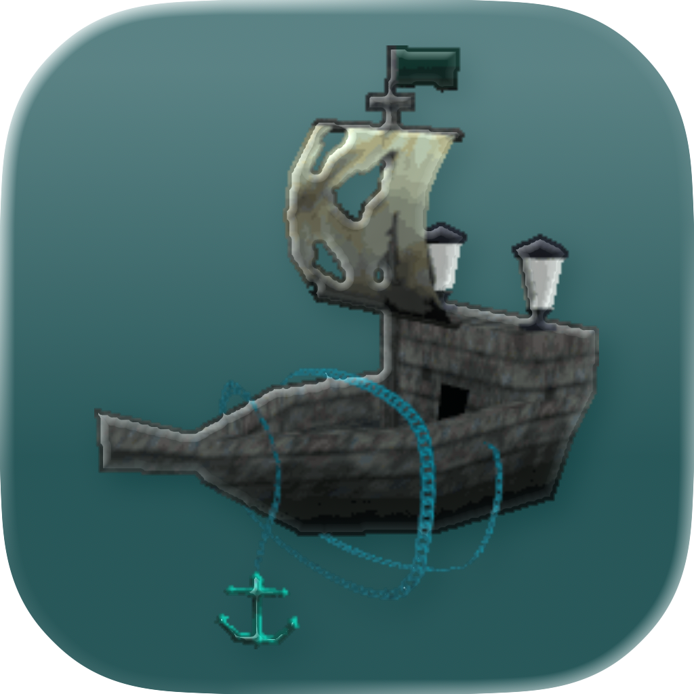
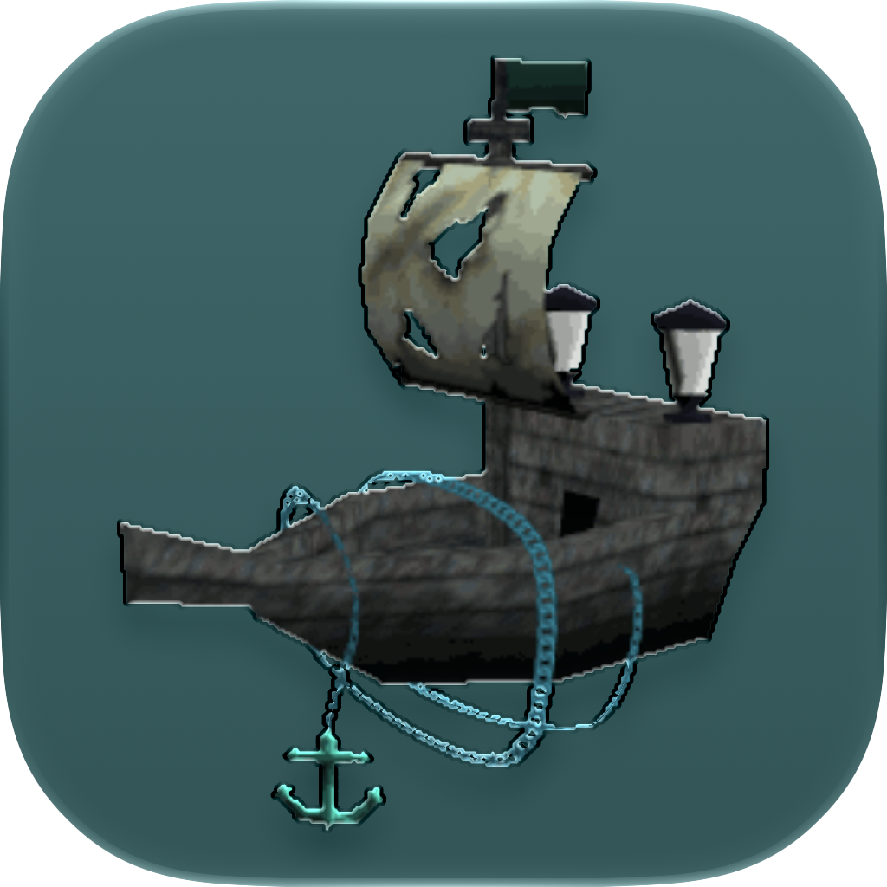

# Ghostship on macOS

<p align="center">
  
  &nbsp;&nbsp;&nbsp;
  
  <br>
  <sub>&nbsp;&nbsp;&nbsp;&nbsp;&nbsp;&nbsp;&nbsp;&nbsp;&nbsp;&nbsp;<b>macOS 26 Tahoe</b>&nbsp;&nbsp;&nbsp;&nbsp;&nbsp;&nbsp;&nbsp;&nbsp;&nbsp;&nbsp;&nbsp;&nbsp;&nbsp;&nbsp;&nbsp;&nbsp;<b>macOS 27 Golden Gate</b></sub>
</p>

This fork carries a set of macOS fixes on top of upstream [HarbourMasters/Ghostship](https://github.com/HarbourMasters/Ghostship) develop. The plan is to submit each fix upstream, and as they land there this fork shrinks; eventually it won't need to exist, which is the goal.


**[Download the latest release](https://github.com/quarrel07/Ghostship-macOS/releases/latest)** (arm64 dmg).

## Branches

- `develop` mirrors upstream.
- `macos-rebase` is upstream develop plus the fixes below, and is what releases are built from.

## What's changed

- HiDPI viewport handling: the game fills the window on Retina displays, and 100% internal resolution means your display's true pixels
- Menu text renders at Retina density, and stays crisp at every menu-scale setting
- The cursor appears only while the menu is open, or with "Cursor Always Visible" enabled
- Holding movement keys doesn't trigger the macOS accent popup
- Save data is mirrored to its backup slot at load ([#207](https://github.com/HarbourMasters/Ghostship/issues/207))
- The app reports its real version ([#219](https://github.com/HarbourMasters/Ghostship/issues/219))
- Liquid Glass app icon on macOS 26+
- Builds against Homebrew's mbedtls@3, and the packaged app bundles SDL3 next to sdl2-compat

Rendering and font changes live in the [libultraship fork branch](https://github.com/quarrel07/libultraship/tree/ghostship-macos-r2) the submodule points at.

## Building

```
git clone --recursive -b macos-rebase https://github.com/quarrel07/Ghostship-macOS.git
cd Ghostship-macOS
cmake -S . -B build -GNinja -DCMAKE_BUILD_TYPE=Release -DSDL2_DIR="$(brew --prefix sdl2-compat)/lib/cmake/SDL2" -DCMAKE_FIND_FRAMEWORK=LAST
cmake --build build --parallel
```

Homebrew dependencies: sdl2-compat, sdl3, glew, libzip, nlohmann-json, tinyxml2, mbedtls@3, ninja. Built and tested on an M-series Mac running macOS 26 with current Xcode; other setups may need adjustments.

Packaging into the dmg is upstream's own CPack flow: `cd build && cpack`.

## Credits

All credit for Ghostship to [Lywx](https://github.com/kiritodv) and the [HarbourMasters](https://github.com/HarbourMasters) team and the [libultraship](https://github.com/Kenix3/libultraship) project.
